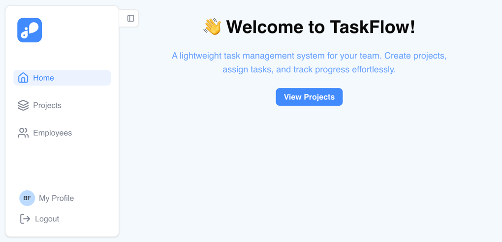
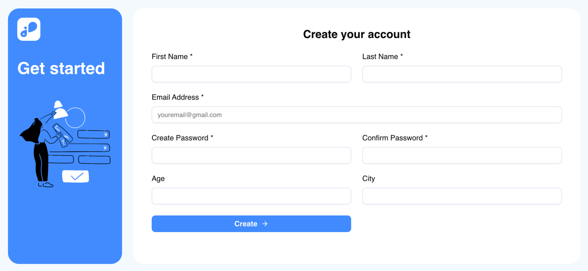
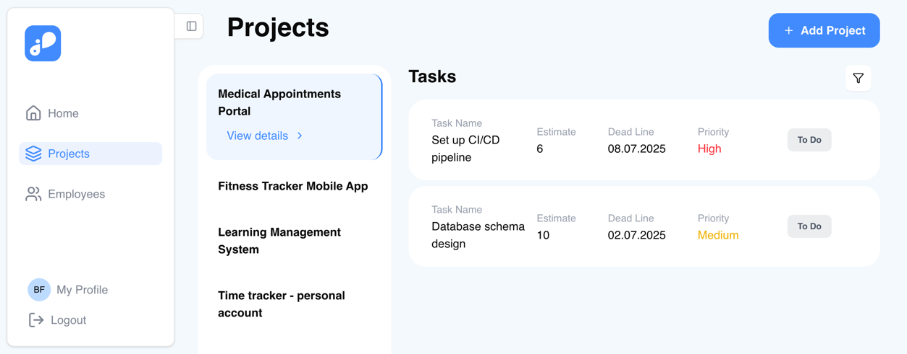
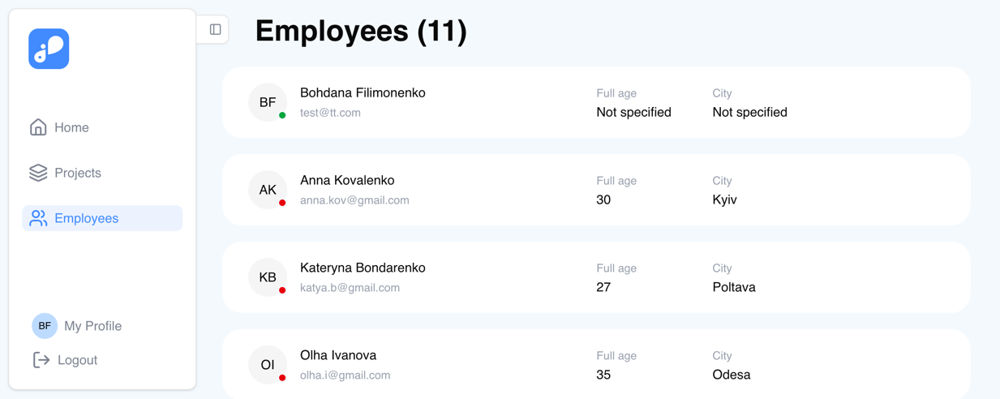

# TaskFlow

A modern full-stack project management application for efficient task and team coordination. TaskFlow provides a comprehensive solution for managing projects, tasks, and team members with role-based access control.

## 📋 Overview

TaskFlow is designed to streamline project and task management workflows. It allows administrators to manage teams, create projects, assign tasks to employees, and track progress. Users can view their assigned tasks, update their status, and manage their profiles. The application features a responsive UI built with React and a robust RESTful API powered by NestJS.

## 🏗️ Project Structure

```
TaskFlow/
├── backend/                 # NestJS backend API
│   ├── src/
│   │   ├── entity/         # TypeORM entities (Users, Projects, Tasks, RefreshTokens)
│   │   ├── migrations/     # Database migrations
│   │   └── modules/        # Feature modules (auth, users, projects, tasks)
│   └── ormconfig.ts        # TypeORM configuration
├── frontend/               # React + Vite frontend
│   ├── public/             # Static assets
│   └── src/
│       ├── api/            # API client and endpoints
│       ├── components/     # Reusable UI components
│       ├── contexts/       # React contexts (Auth, Theme, etc.)
│       ├── guards/         # Route guards (Auth, Role-based)
│       ├── hooks/          # Custom React hooks
│       ├── layouts/        # Layout components
│       └── pages/          # Page components
├── screenshots/            # Application screenshots
└── package.json            # Root workspace configuration
```

## 🚀 Tech Stack

### Backend
- **Framework**: NestJS 11.x
- **Language**: TypeScript 5.7.x
- **Database**: PostgreSQL
- **ORM**: TypeORM 0.3.x
- **Authentication**: JWT (access & refresh tokens)
- **Password Hashing**: bcrypt
- **Validation**: class-validator, class-transformer
- **API Documentation**: Swagger/OpenAPI
- **Testing**: Jest, Supertest

### Frontend
- **Framework**: React 19.x
- **Build Tool**: Vite 6.x
- **Language**: TypeScript 5.8.x
- **Routing**: React Router DOM 7.x
- **State Management**: TanStack React Query 5.x, React Context API
- **Form Handling**: Formik, React Hook Form, Yup, Zod
- **UI Components**: Radix UI primitives
- **Styling**: Tailwind CSS 4.x
- **Icons**: Lucide React
- **Notifications**: React Toastify
- **Date Handling**: date-fns, React Day Picker

### Common Development Tools
- **Code Quality**: ESLint, Prettier
- **Package Manager**: npm

## 📸 Screenshots

### Home Page


### Login Page


### Signup Page


### Projects Page


### Employees Page


### User Profile Page


## 📦 Prerequisites

Before running this project, ensure you have the following installed:

- **Node.js**: v18.x or higher
- **npm**: v9.x or higher
- **PostgreSQL**: v14.x or higher

## ⚙️ Environment Variables

### Backend (`backend/.env`)

Create a `.env` file in the `backend` directory with the following variables:

```env
# Database Configuration
DB_HOST=localhost
DB_PORT=5432
DB_USER=task_flow
DB_PASS=your_database_password
DB_NAME=task_flow
DB_USE_SSL=false
DB_SSL_CERTS=secret

# Authentication
SALT_ROUNDS=10
JWT_SECRET_KEY=your_jwt_secret_key
ACCESS_SECRET=your_access_secret
REFRESH_SECRET=your_refresh_secret

# Server Port (optional, defaults to 3000)
PORT=3000
```

### Frontend (`frontend/.env`)

Create a `.env` file in the `frontend` directory:

```env
VITE_API_URL=http://localhost:3000/
```

## 🚀 Installation & Running

### Option 1: Run from Root (Recommended)

1. **Clone the repository**
   ```bash
   git clone https://github.com/bFilimonenko/TaskFlow.git
   cd TaskFlow
   ```

2. **Install all dependencies**
   ```bash
   npm run install:all
   ```

3. **Set up environment variables**
   - Create `.env` files in `backend/` and `frontend/` directories as shown above

4. **Set up the database**
   ```bash
   # Create PostgreSQL database
   createdb task_flow
   
   # Run migrations
   npm run migrations:up
   ```

5. **Run the full application**
   ```bash
   npm run dev
   ```
   - Backend will run on http://localhost:3000
   - Frontend will run on http://localhost:3005
   - Swagger API documentation: http://localhost:3000/api

### Option 2: Run Backend and Frontend Separately

#### Backend Setup

```bash
cd backend

# Install dependencies
npm install

# Run migrations
npm run migrations-up

# Start development server
npm run start:dev
```

Backend will be available at http://localhost:3000

#### Frontend Setup

```bash
cd frontend

# Install dependencies
npm install

# Start development server
npm run dev
```

Frontend will be available at http://localhost:3005

## 📜 Available Scripts

### Root Scripts

| Script | Description |
|--------|-------------|
| `npm run install:all` | Install dependencies for root, backend, and frontend |
| `npm run dev` | Run both backend and frontend in development mode |
| `npm run dev:backend` | Run backend in development mode |
| `npm run dev:frontend` | Run frontend in development mode |
| `npm run build` | Build both backend and frontend for production |
| `npm run build:backend` | Build backend for production |
| `npm run build:frontend` | Build frontend for production |
| `npm run migrations:up` | Run database migrations |
| `npm run migrations:down` | Revert last database migration |
| `npm run lint` | Lint all code (root, backend, frontend) |
| `npm run lint:fix` | Auto-fix linting issues |
| `npm run format` | Format all code with Prettier |

### Backend Scripts

| Script | Description |
|--------|-------------|
| `npm run start` | Start backend in production mode |
| `npm run start:dev` | Start backend with hot-reload |
| `npm run start:debug` | Start backend in debug mode |
| `npm run build` | Build backend for production |
| `npm run test` | Run unit tests |
| `npm run test:e2e` | Run end-to-end tests |
| `npm run test:cov` | Run tests with coverage |
| `npm run migrations-up` | Run database migrations |
| `npm run migrations-down` | Revert last migration |

### Frontend Scripts

| Script | Description |
|--------|-------------|
| `npm run dev` | Start Vite development server |
| `npm run build` | Build frontend for production |
| `npm run preview` | Preview production build locally |
| `npm run lint` | Lint frontend code |

## 🔐 User Roles

The application supports two user roles:

- **ADMIN**: Full access to manage users, projects, and tasks
- **USER**: Access to view assigned tasks and update their status

## 🗄️ Database Migrations

The project uses TypeORM migrations for database schema management. Migrations are located in `backend/src/migrations/`.

```bash
# Run migrations
cd backend
npm run migrations-up

# Revert last migration
npm run migrations-down
```

## 🧪 Testing

### Backend Tests

```bash
cd backend

# Unit tests
npm run test

# E2E tests
npm run test:e2e

# Test coverage
npm run test:cov
```

## 📝 API Documentation

Once the backend is running, visit http://localhost:3000/api to access the interactive Swagger API documentation.

## 🎨 Code Quality

This project uses ESLint and Prettier to maintain code quality and consistency.

```bash
# Lint all code
npm run lint

# Auto-fix linting issues
npm run lint:fix

# Format code with Prettier
npm run format
```

## 📌 Notes & Limitations

- The application requires a PostgreSQL database to be set up before running
- JWT tokens are used for authentication with 1-hour access tokens and 7-day refresh tokens
- The frontend is configured to run on port 3005 and backend on port 3000 by default
- CORS is enabled on the backend for local development
- Database migrations must be run manually after setup

## 👤 Author

Bohdana Filimonenko

---

**Happy Task Management! 🎯**

